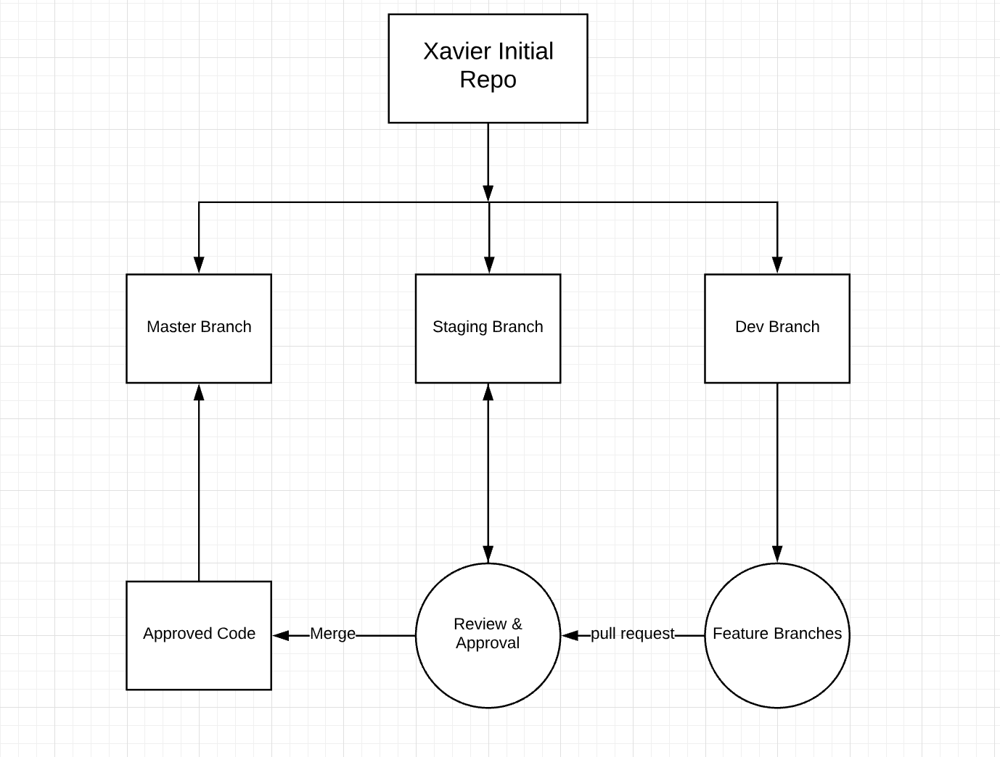

# XAVIER-GIT-BRANCHING-STRATEGY

* The central repo holds three main branches with an infinite lifetime master,staging and develop.
* The `master` branch at origin should be familiar to every Git user. Parallel to the master branch, another branch exists called staging.
* We consider origin/master to be the main branch where the source code of HEAD always reflects a production-ready state.
* We consider origin/staging to be the main branch where the source code of HEAD always reflects a state with the latest delivered development changes.
* When the source code in the staging branch reaches a stable point and is ready to be released, all of the changes should be merged back into master.
* We are using develop branch Next to the main branches master and staging, our development model uses a variety of supporting branches to aid parallel development between team members, ease tracking of features, prepare for production releases and to assist in quickly fixing live production problems.
* One should only be branching off from develop branch and can merge it again towards the same branch or can create a pull request towards `staging` when the code is ready to be reviewed.
* Each of these branches have a specific purpose and are bound to strict rules as to which branches may be their originating branch and which branches must be their merge targets.
* We allow the Pull Requests from dev to staging having each developer work in their own fork of the repo created towards dev
* This allows developers to create whatever branches they want without polluting the main fork of the repository.
